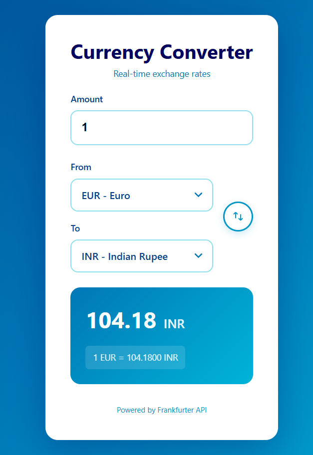

# 💱 Currency Converter

A modern, real-time currency converter built with React and Vite. Features a searchable dropdown interface with support for 30+ currencies, powered by the Frankfurter API.



## 🌟 Features

- **Real-time Conversion** - Live currency conversion as you type
- **Searchable Dropdowns** - Type to filter currencies by code or name
- **30+ Currencies** - Supports all major world currencies
- **Debounced API Calls** - Optimized to prevent excessive API requests
- **Keyboard Navigation** - Full keyboard support for accessibility
- **Exchange Rate Display** - Shows the current exchange rate
- **Responsive Design** - Works beautifully on desktop, tablet, and mobile
- **Modern UI** - Clean interface with smooth animations
- **Error Handling** - Graceful error messages and loading states

## 🚀 Live Demo

[View Live Demo](https://mosaicsoft.github.io/currency-converter-v2/)

## 🛠️ Tech Stack

- **React 18.2** - UI library
- **Vite 5.2** - Build tool and dev server
- **Vanilla CSS** - Styling with CSS variables
- **Frankfurter API** - Free currency conversion API

## 📁 Project Structure

```
currency-converter/
├── src/
│   ├── components/           # React components
│   │   ├── CurrencySelect.jsx    # Searchable currency dropdown
│   │   ├── SwapButton.jsx        # Currency swap button
│   │   ├── LoadingSpinner.jsx    # Loading indicator
│   │   └── ConverterForm.jsx     # Main form component
│   ├── hooks/                # Custom React hooks
│   │   └── useCurrencyConverter.js   # Conversion logic hook
│   ├── services/             # API layer
│   │   └── currencyService.js    # API calls
│   ├── App.jsx               # Root component
│   ├── App.css               # Global styles
│   └── main.jsx              # Entry point
├── package.json
├── vite.config.js
└── README.md
```

## 🏗️ Architecture & Design Decisions

### Component Architecture

The project follows a **layered architecture** pattern:

1. **Service Layer** (`services/`) - Pure API functions with no React dependencies
2. **Hook Layer** (`hooks/`) - Business logic and state management
3. **Component Layer** (`components/`) - Presentational components
4. **App Layer** - Root component that orchestrates everything

This separation ensures:

- **Testability** - Each layer can be tested independently
- **Reusability** - Components and hooks can be reused
- **Maintainability** - Clear separation of concerns
- **Scalability** - Easy to extend with new features

### Key Design Patterns

**Custom Hook Pattern**

```javascript
useCurrencyConverter(); // Encapsulates all conversion logic
```

- Separates business logic from UI
- Makes the logic reusable across components
- Easier to test and maintain

**Debouncing**

- Implements 500ms debounce on API calls
- Prevents excessive API requests while typing
- Improves performance and user experience

**AbortController**

- Cancels previous API requests when new ones are made
- Prevents race conditions
- Ensures the latest result is always displayed

**Searchable Dropdown**

- Custom implementation (not native `<select>`)
- Supports keyboard navigation (Arrow keys, Enter, Escape)
- Filters currencies in real-time
- Better UX than standard dropdowns

### Styling Approach

- **CSS Variables** - All colors defined in `:root` for easy theming
- **Semantic Naming** - `--color-primary`, `--color-text-primary`, etc.
- **No CSS-in-JS** - Keeping concerns separated
- **Responsive Grid/Flexbox** - Modern layout techniques
- **Mobile-First** - Optimized for all screen sizes

## 🎨 Color Palette

The project uses a beautiful blue gradient palette:

```css
--color-navy-deep: #03045e
--color-navy-dark: #023e8a
--color-blue-medium: #0077b6
--color-blue-bright: #0096c7
--color-cyan-blue: #00b4d8
--color-cyan-light: #48cae4
--color-sky-blue: #90e0ef
--color-pale-blue: #ade8f4
--color-blue-lightest: #caf0f8
```

## 💡 Development Process

### Problem-Solving Approach

1. **Initial Implementation** - Started with basic functionality
2. **Performance Optimization** - Added debouncing and request cancellation
3. **UX Improvements** - Enhanced with searchable dropdowns and better error handling
4. **Accessibility** - Added ARIA labels, keyboard navigation, and focus management
5. **Responsive Design** - Ensured great experience on all devices
6. **Code Quality** - Refactored into modular, testable components

### Challenges & Solutions

**Challenge 1: API Rate Limiting**

- **Solution**: Implemented debouncing (500ms) to reduce API calls while maintaining responsive UI

**Challenge 2: Race Conditions**

- **Solution**: Used AbortController to cancel outdated requests

**Challenge 3: Dropdown UX**

- **Solution**: Built custom searchable dropdown with keyboard navigation instead of native `<select>`

**Challenge 4: Layout Complexity**

- **Solution**: Used CSS Grid for flexible, responsive layout with floating swap button

## 🚧 Known Limitations

1. **No Offline Support** - Requires internet connection for API calls
2. **Limited to Frankfurter API** - Dependent on a single API provider
3. **No Historical Rates** - Only supports current exchange rates
4. **No Favorites** - Cannot save frequently used currency pairs
5. **No Currency Symbols** - Displays codes (USD) but not symbols ($)
6. **No Amount Formatting** - No thousand separators or localization
7. **Browser Storage Not Used** - No persistence of user preferences

## 🔮 Future Enhancements

### High Priority

- [ ] **Add Historical Rates** - Date picker to view past exchange rates
- [ ] **Offline Support** - Cache recent rates for offline use
- [ ] **Favorites** - Save frequently used currency pairs
- [ ] **Local Storage** - Remember user's last selected currencies
- [ ] **Amount Formatting** - Add thousand separators and decimal formatting

### Medium Priority

- [ ] **Multiple Conversions** - Convert to multiple currencies simultaneously
- [ ] **Currency Symbols** - Display currency symbols alongside codes
- [ ] **Dark Mode** - Toggle between light and dark themes
- [ ] **Charts** - Visualize exchange rate trends
- [ ] **Comparison Mode** - Compare multiple currencies side by side

### Nice to Have

- [ ] **TypeScript Migration** - Add type safety
- [ ] **Unit Tests** - Add comprehensive test coverage with Vitest
- [ ] **E2E Tests** - Add Playwright or Cypress tests
- [ ] **PWA Support** - Make it installable as a Progressive Web App
- [ ] **Multi-language Support** - i18n for different languages
- [ ] **Export Feature** - Export conversion history to CSV
- [ ] **API Key Configuration** - Support for multiple API providers

## 🤝 Contributing

This is an open-source project and contributions are welcome! Whether you're fixing bugs, improving documentation, or proposing new features, your help is appreciated.

### How to Contribute

1. **Fork the repository**
2. **Create a feature branch**
   ```bash
   git checkout -b feature/amazing-feature
   ```
3. **Make your changes**
4. **Commit with descriptive messages**
   ```bash
   git commit -m "Add: Feature description"
   ```
5. **Push to your branch**
   ```bash
   git push origin feature/amazing-feature
   ```
6. **Open a Pull Request**

### Contribution Guidelines

- Follow the existing code style and architecture
- Write clear, descriptive commit messages
- Update documentation if needed
- Test your changes thoroughly
- Add comments for complex logic
- Keep PRs focused on a single feature/fix

### Good First Issues

Looking for a place to start? Try these:

- Add PropTypes or TypeScript types
- Improve error messages
- Add loading skeletons
- Implement dark mode
- Add unit tests
- Improve mobile responsiveness
- Add currency symbols

## 🚀 Getting Started

### Prerequisites

- Node.js (v16 or higher)
- npm or yarn

### Installation

1. **Clone the repository**

   ```bash
   git clone https://github.com/yourusername/currency-converter.git
   cd currency-converter
   ```

2. **Install dependencies**

   ```bash
   npm install
   ```

3. **Start the development server**

   ```bash
   npm run dev
   ```

4. **Open your browser**
   ```
   http://localhost:5173
   ```

### Build for Production

```bash
npm run build
```

The built files will be in the `dist/` directory.

### Preview Production Build

```bash
npm run preview
```

## 📝 Available Scripts

- `npm run dev` - Start development server
- `npm run build` - Build for production
- `npm run preview` - Preview production build
- `npm run lint` - Run ESLint

## 🔗 API Reference

This project uses the [Frankfurter API](https://www.frankfurter.app/) - a free, open-source API for currency exchange rates.

**Endpoints used:**

- `GET /currencies` - Get list of available currencies
- `GET /latest?amount={amount}&from={code}&to={code}` - Get conversion rate

**Rate Limits:**

- No authentication required
- No rate limits (fair use policy)
- Data updated daily from European Central Bank

## 📄 License

This project is licensed under the MIT License - see the [LICENSE](LICENSE) file for details.

## 👨‍💻 Author

**Sasmit Vasantgadkar**

- GitHub: [@mosaicsoft](https://github.com/mosaicsoft)
- LinkedIn: [Sasmit Vasantgadkar](https://linkedin.com/in/sasmitv)
<!-- - Portfolio: [yourwebsite.com](https://yourwebsite.com) -->

## 🙏 Acknowledgments

- [Frankfurter API](https://www.frankfurter.app/) for the free currency data
- [Coolors](https://coolors.co/) for the color palette
- [Lucide Icons](https://lucide.dev/) for the swap icon
- React and Vite teams for amazing tools

## 📊 Project Stats


---

**⭐ If you find this project useful, please consider giving it a star!**

Made with ❤️ and React
